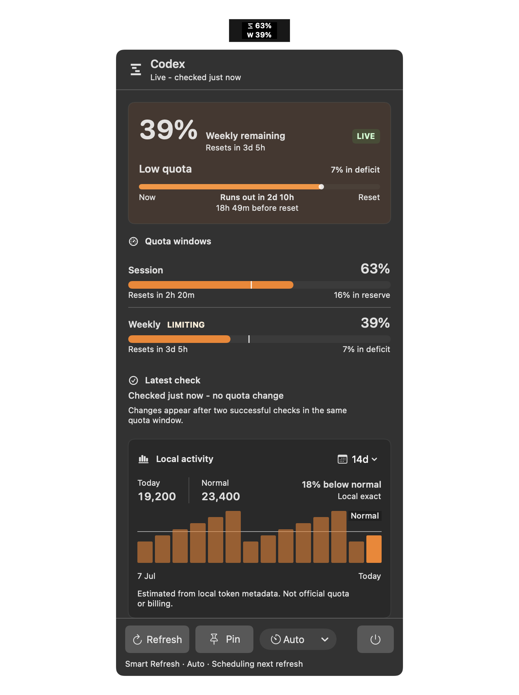
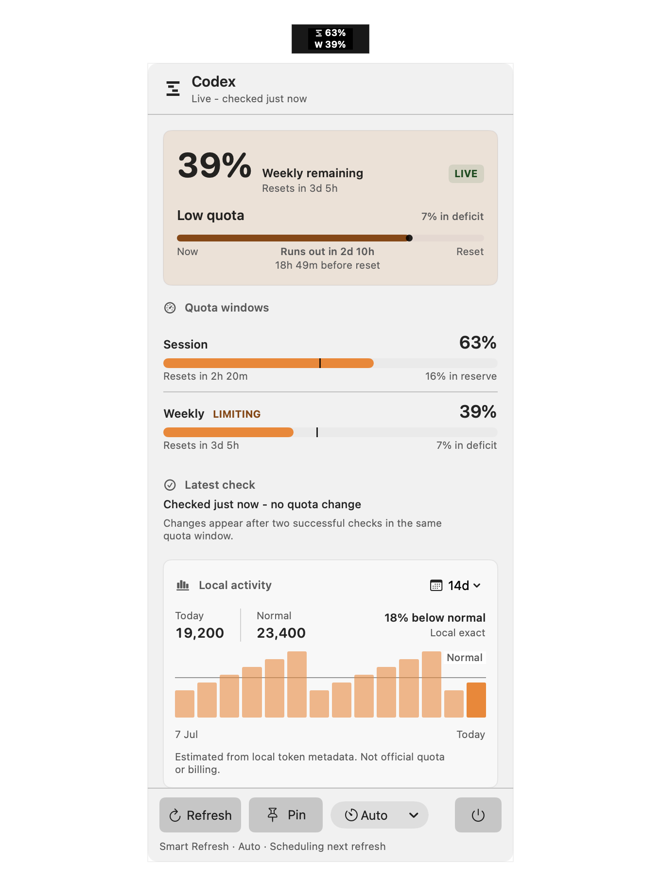

# Codex Balance

Codex Balance is a native macOS menu-bar utility that turns OpenAI Codex quota
windows and local activity into a compact runway view.



The dashboard keeps Session and Weekly quota visible, estimates whether the
remaining allowance lasts until reset, shows changes since the last verified
check, and summarizes local token activity. Adaptive Refresh uses a faster
cadence while the dashboard is active, slows down when quiet, pauses while the
Mac is locked or asleep, applies jitter, and respects source cooldowns.

## What it shows

- Session, Weekly, and additional supported quota windows
- runway, target pace comparison, reset countdowns, and freshness
- local 7/14/30-day token activity, model mix, recent work, and estimated cost
- sanitized diagnostics without tokens, raw records, or credential paths
- synthetic loading, stale, unavailable, error, contrast, and size fixtures



## Requirements

- macOS 14 or later
- Swift 6 toolchain or Xcode 16 or later
- Codex CLI installed and signed in for live quota sources

## Build and verify

```sh
swift build
swift test
Scripts/test.sh
Scripts/package_app.sh
dist/CodexBalance.app/Contents/MacOS/CodexBalance --smoke-check
Scripts/status_signing.sh
```

`Scripts/package_app.sh` creates a local ad-hoc-signed app. It does not create
an official release, Developer ID signature, notarization ticket, installer,
or auto-update channel. An optional local identity can be supplied with
`CODEX_BALANCE_CODESIGN_IDENTITY`; never commit a personal identity name.

Run the packaged app with `Scripts/run_practical.sh`. Open at Login is optional
and explicit; see [Development](docs/DEVELOPMENT.md) before installing it.

## Privacy and limits

Codex Balance has no project-operated backend. Live quota checks connect
directly to OpenAI through authenticated local sources. Local analytics
temporarily parses local Codex log records to extract timestamps, model names,
and token counters; it does not persist prompts, messages, raw JSON, tokens, or
credential contents. See [Privacy](PRIVACY.md) and
[Data Sources](docs/DATA_SOURCES.md).

Local analytics and cost figures are partial estimates. They are not invoices,
subscription accounting, or official billing records. Unknown model pricing
is reported as unavailable rather than guessed.

Codex Balance is an independent open-source project. It is not affiliated
with, endorsed by, or sponsored by OpenAI. OpenAI and Codex are trademarks of
their respective owner. The project uses its own mark and does not bundle an
OpenAI logo.

## Documentation

- [Architecture](docs/ARCHITECTURE.md)
- [Development and validation](docs/DEVELOPMENT.md)
- [Data sources](docs/DATA_SOURCES.md)
- [Troubleshooting](docs/TROUBLESHOOTING.md)
- [Security](SECURITY.md)
- [Contributing](CONTRIBUTING.md)

Source version: `0.1.1`.
